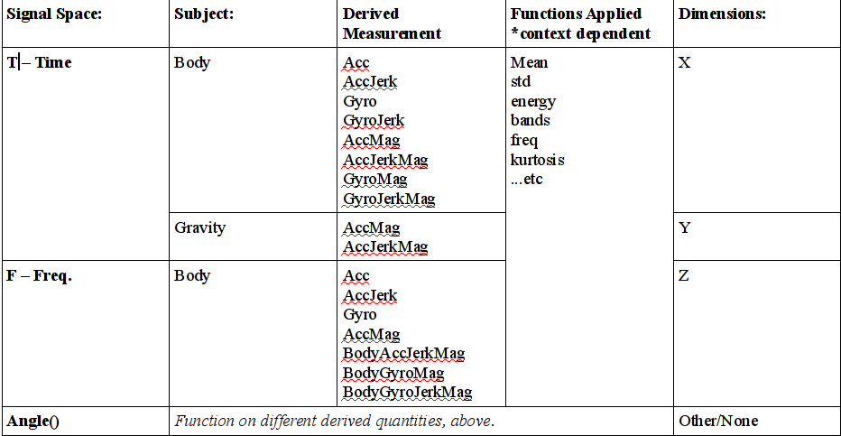

## Code Book:

### Raw Data Generation:

Thirty voulenteers performed six activities while wearing smartphones. The sensor data from the smartphone's accelerometer and gyroscope was recorded. This data is stored in the ./Intertial Signals/ folders in the **UCI HAR Dataset** folder. 

**Note:** This data is not used in our script. It was used to generate training and test data 

### Constructed Features:

Using the Raw Data, researchers constructed 561 Features using a variety of transformations. The variables are highly catagoried and complex. To show the stucture, I have made a table based on the variable sting names. See below:

For a full description, see **features_info.txt**. 

### Training, Test and Label Data:

The dataset itself is divided up to facilitate supervised learning and partitioned into training and test sets. A neural net (or other learning algorithm) is given Feature data (X) and must infer the Activity being performed (Y). 

The data set is organized as follows:

* **activity_labels.txt**: Our X data tables use numbers to label activities; this file contains the label names, and allows us to map the names to numbers.
* **features.txt**: A list of all 561 features in our X training and test data.
* **./test**:
    * **subject_test.txt** : Relates subject to Feature row.
    * **X_test.txt**
    * **y_test.txt**
* **./train**:
    * **subject_train.txt**
    * **X_train.txt**
    * **y_train.txt**
  
The split between test and training data is roughly 30/70. 

### Processing Steps:

The **run_analysis.R** script performs the following

0. Reads in all relevent datafiles using the read.table() command.
1. Creates the full data frame (**fullDF**). Data from the training, test, subject and activity files are merged into one data frame using the cbind() and rbind() commands. The 
columns are named manually, and with names from the **features.txt** file.
2. Columns that contain "mean" and "std" in the name are selected. There are 33 of each, resepctively.
3. A final data frame (**finalDF**) is constructed, by subsetting fullDF and using cbind(). Before the columns in finalDF are named, the raw names of the mean and std columns are filtered for symbols (such as "()-"), and converted to lower case. They are then assigned to the finalDF using the names() function.
4. Regex filtering is applied to the activity names, and the activity column is converted to short, descriptive labels (instead of meaningless integers).
5. A second data frame called **tidyDF**, using the reshape2 library and the melt function. Our ID columns are "subject"" and "y"."
6. finalDF and tidyDF are written to .csv files, as a final output.
  
  
  
**END**
